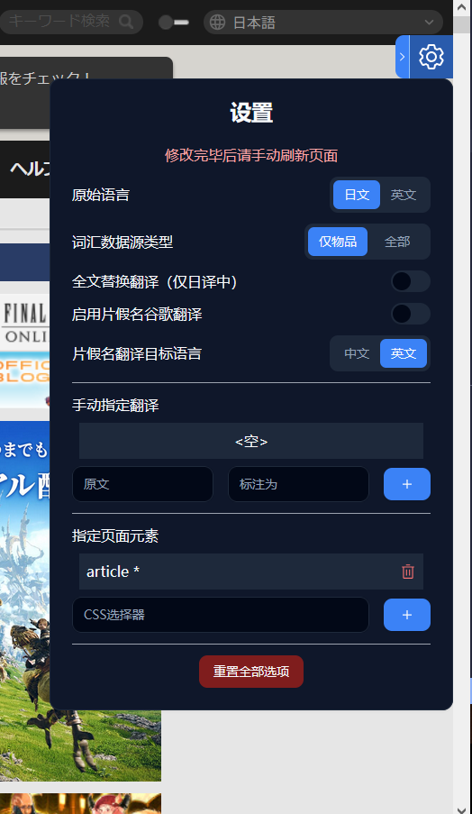

# FF14 Lodestone 自动翻译

## 安装使用
需要油猴：https://www.tampermonkey.net/index.php?locale=zh

安装脚本：[Latest Github Releases](https://github.com/UnluckyNinja/ffxiv-lodestone-translation/releases/latest)

默认只匹配以下地址

- `https://jp.finalfantasyxiv.com/lodestone/topics/detail/*`
- `https://na.finalfantasyxiv.com/lodestone/topics/detail/*`

例如： https://jp.finalfantasyxiv.com/lodestone/topics/detail/323be12f6a94adb359375e016130e9e1a200e753

但你也可手动在脚本头部信息中添加 @match 属性以匹配其它页面，  
例如 `// @match https://*.domain.com/*`  
工具会按指定的元素选择器对内容进行翻译

*.fflate 文件为手动更新：https://observablehq.com/d/25ec8057300114c3